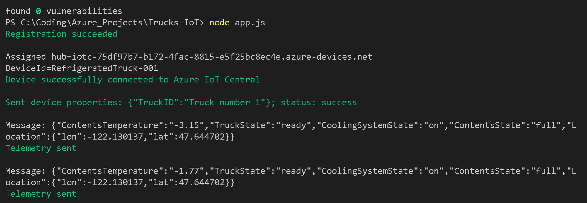
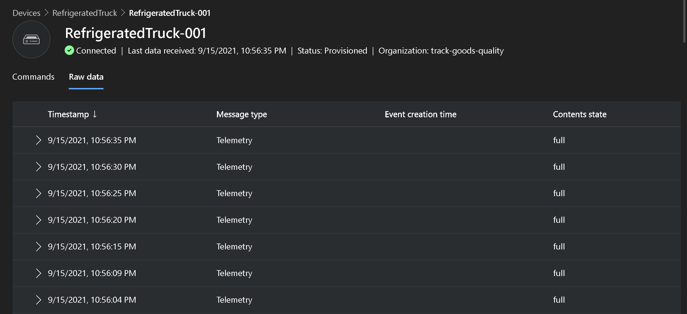

# Track-cooling-Capabilities-azureIoT
 
 This project is inspired from the [Azure IoT Learning Path to creating a basic Azure IoT app](https://docs.microsoft.com/en-us/learn/modules/create-your-first-iot-central-app/1-introduction) . 
 
 ## Objective 
 The main objective is to create an application on IoT Central Hub which has the capabilities of tracking mulitple devices from different geo locations. 
 The application can track various properties of the object. 
 
 ## Problem Statement 
 Multiple trucks with cooling facility are deployed to deliver goods to customer which are of good quality. They all operate from one base and travel to various regional
 places across Seattle. The main objective is to track the quality of goods, the cooling status, in order to make sure the customer recieves good quality goods in
 optimised time. 
 
 ## Solution 
 
 We create an Azure IoT Central custom app by using the IoT Central portal.
and Create a device template for a custom device by using the IoT Central portal.
Create a programming project to simulate a refrigerated truck, with routes selected by Azure Maps.

## Technical Requirements
1. Azure account - to access IoT Central Hub
2. Azure Maps 
3. npm - node package manager 
4. nodejs
5. visual studio code 

## Outcomes 

